# TechLibs Agent Workflow - Mermaid Diagrams

## 1. Overall Workflow Architecture

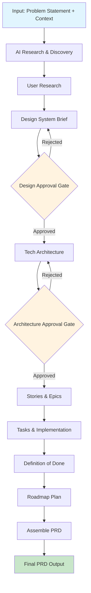

## 2. Enhanced Input Schema Structure

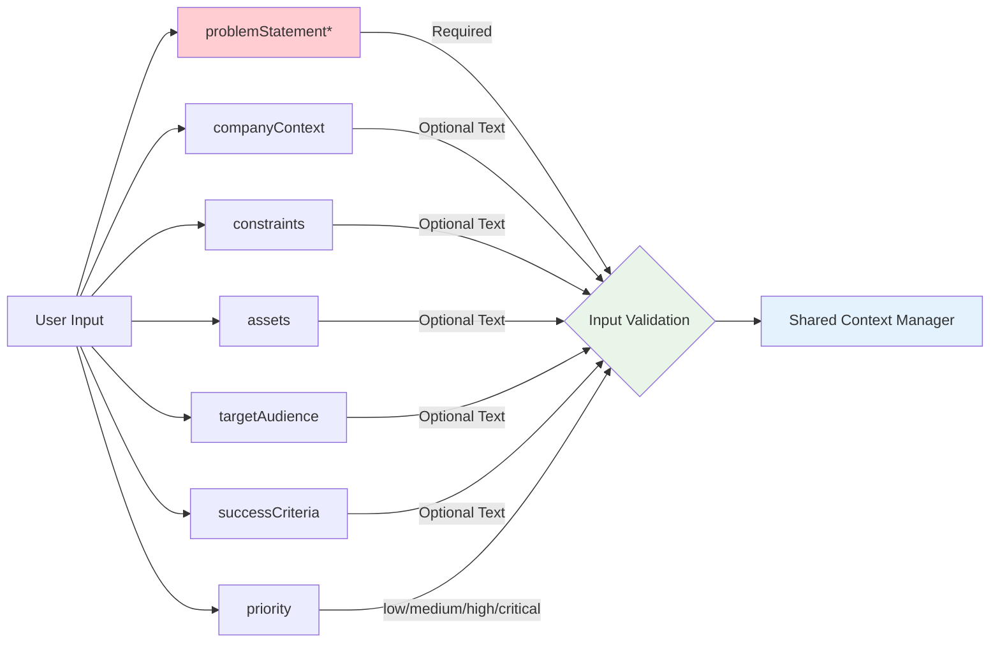

## 3. Shared Context Management System

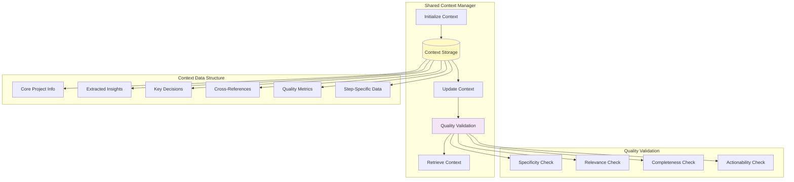

## 4. Agent Architecture Deep Dive

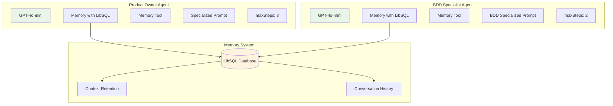

## 5. AI Research & Discovery Step Detail

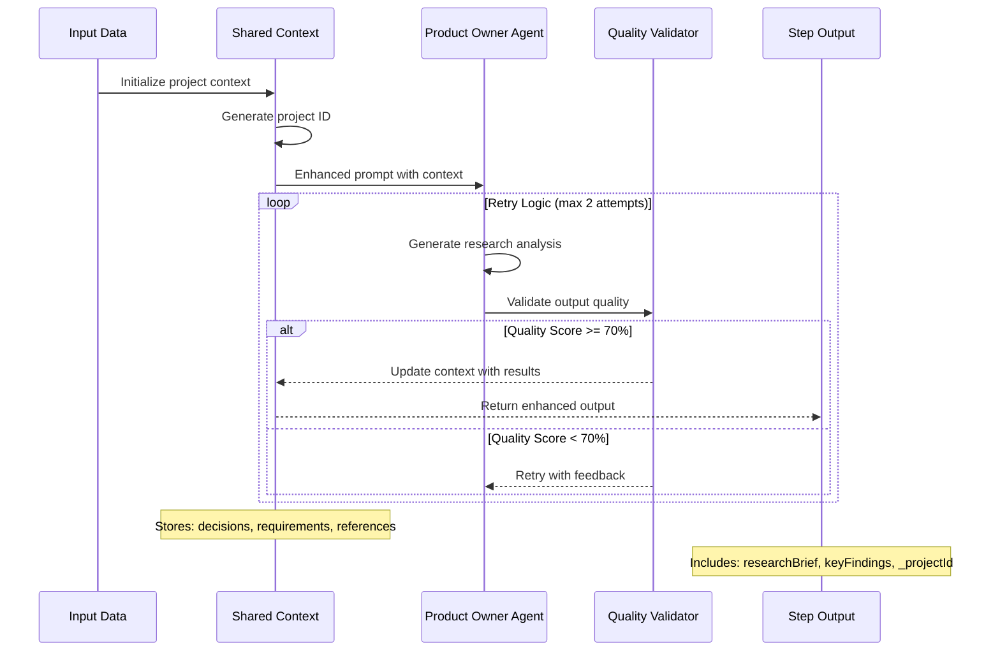

## 6. User Research Step Detail

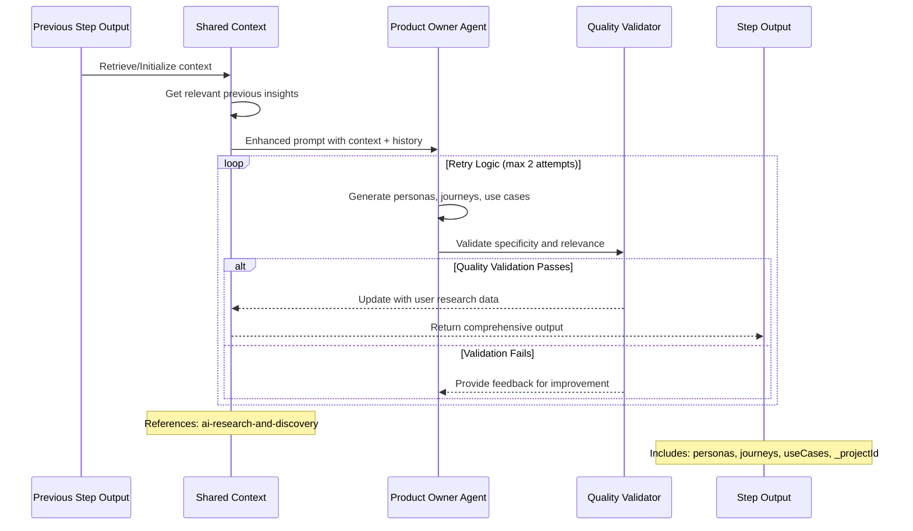

## 7. Stories & Epics Step (Enhanced)

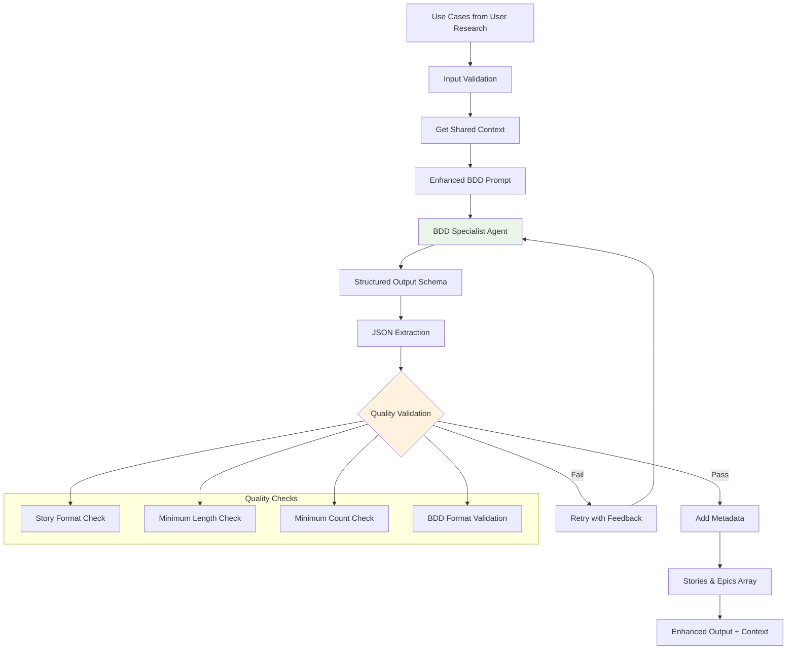

## 8. Observability & Monitoring Flow

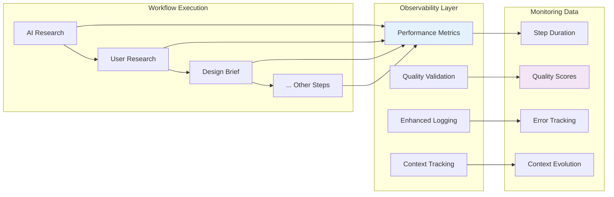

## 9. Error Handling & Retry Logic

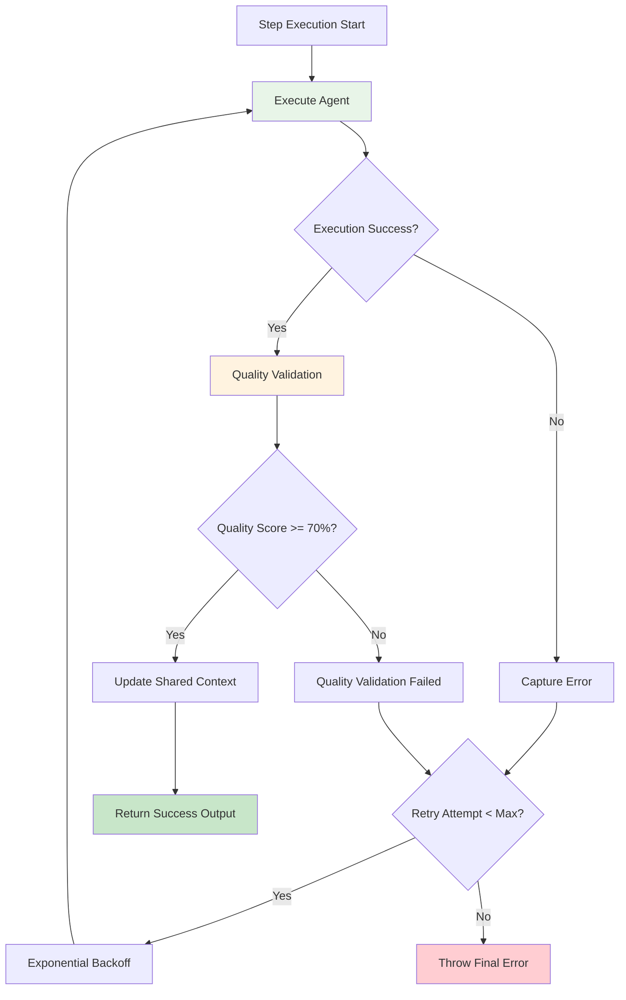

## 10. Complete Data Flow

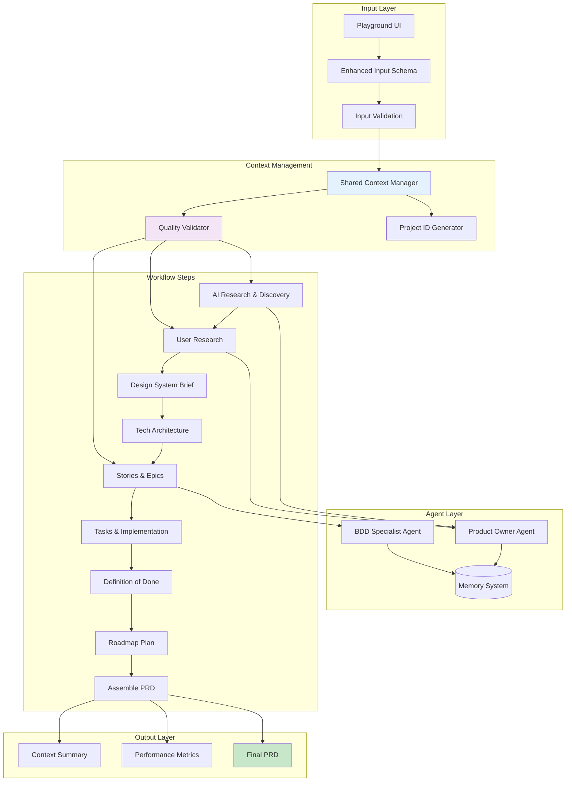

## 11. Key Improvements Summary

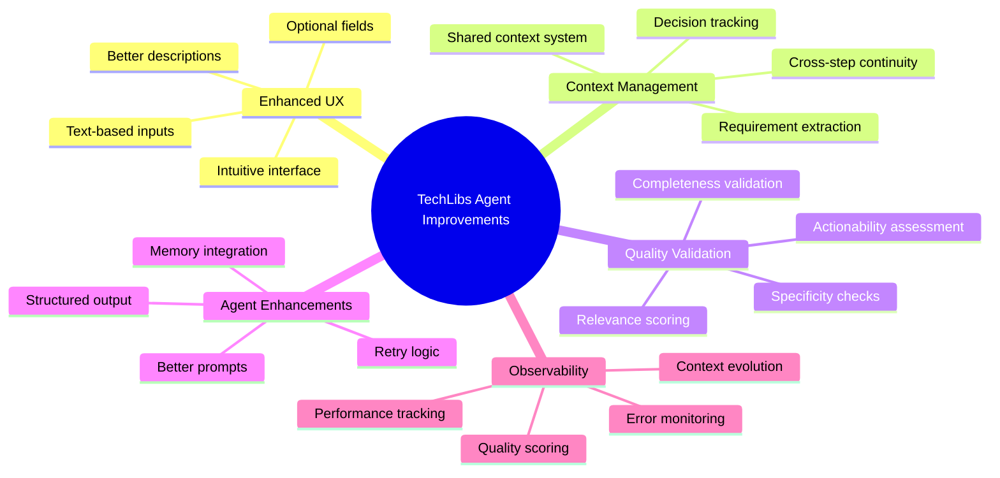

This comprehensive set of Mermaid diagrams covers every aspect of the TechLibs Agent workflow system, from the high-level architecture down to detailed step execution flows, error handling, and quality validation processes.